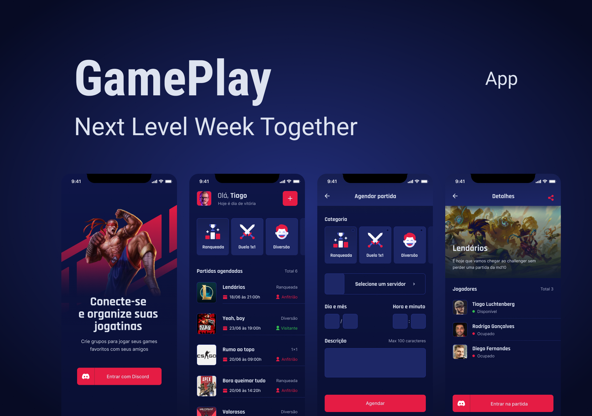

<h1 align="center">
    
</h1>

<p align="center">
  <a href="#-tecnologias">Tecnologias</a>&nbsp;&nbsp;&nbsp;|&nbsp;&nbsp;&nbsp;
  <a href="#-como-usar">Como usar</a>&nbsp;&nbsp;&nbsp;|&nbsp;&nbsp;&nbsp;
  <a href="#-projeto">Projeto</a>&nbsp;&nbsp;&nbsp;|&nbsp;&nbsp;&nbsp;
  <a href="#-layout">Layout</a>&nbsp;&nbsp;&nbsp;|&nbsp;&nbsp;&nbsp;
  <a href="#-sobre">Sobre</a>&nbsp;&nbsp;&nbsp;|&nbsp;&nbsp;&nbsp;
  <!-- <a href="#-pendências-e-melhorias">Pendências e Melhorias</a>&nbsp;&nbsp;&nbsp; -->
</p>

<p align="center">
  
</p>

## 🔗 Tecnologias

Esse projeto foi desenvolvido com as seguintes tecnologias:

- [React Native](https://reactnative.dev/)
- [Expo](https://expo.io/)
- [TypeScript](https://www.typescriptlang.org/)
- [Styled-Components](https://styled-components.com/)

## 🔎 Como usar

Para clonar e executar este aplicativo, você precisará do [Git](https://git-scm.com), [Node.js](https://nodejs.org/en/) e [Expo](https://expo.io/), instalado no seu computador. Da sua linha de comando:

```bash
# Clone o repositório
$ git clone https://github.com/GustavCunha/gameplay.git e cd gameplay

# Instale as dependências
$ npm install ou yarn install

# Execute o aplicativo
$ expo start
```

## 💻 Projeto

O GamePlay é um app organizar suas jogatinas e criar grupos para jogar junto com seus amigos, colegas ou até no intervalo do trabalho.

## 🔖 Layout

Você pode visualizar o layout do projeto através dos links abaixo:

- [Layout](https://www.figma.com/file/0kv33XYjvOgvKGKHBaiR07/GamePlay-NLW-Together/duplicate) 

Lembrando que você precisa ter uma conta [Figma](http://figma.com/) para acessá-lo.

## 📜 Sobre

Este é um projeto desenvolvido durante a **[Next Level Week](https://nextlevelweek.com/)**, apresentado por **[@Rocketseat](https://github.com/Rocketseat)** de 20 a 28 de Junho de 2021. <br/>
Através desse treinamento da Rocketseat, pude aprender novos aspectos do React Native e pretendo criar novas funcionalidades neste app, ou a partir do mesmo elaborar novas ideias para um projeto futuro!
